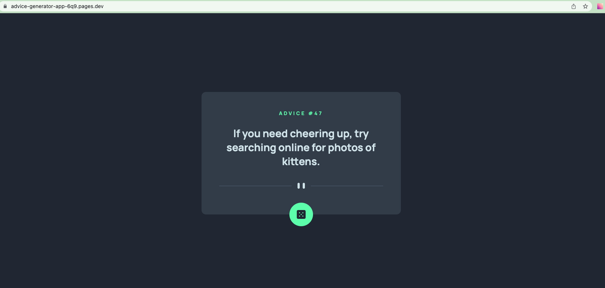

# Frontend Mentor - Advice generator app solution

This is a solution to the [Advice generator app challenge on Frontend Mentor](https://www.frontendmentor.io/challenges/advice-generator-app-QdUG-13db).

## Table of contents

- [Overview](#overview)
  - [The challenge](#the-challenge)
  - [Screenshot](#screenshot)
  - [Links](#links)
- [My process](#my-process)
  - [Built with](#built-with)
  - [What I learned](#what-i-learned)
  - [Continued development](#continued-development)
  - [Useful resources](#useful-resources)
- [Author](#author)
- [Acknowledgments](#acknowledgments)

## Overview

### The challenge

Users should be able to:

- View the optimal layout for the app depending on their device's screen size
- See hover states for all interactive elements on the page
- Generate a new piece of advice by clicking the dice icon

### Screenshot

### Links

- Solution: [frontendmentor.io](https://www.frontendmentor.io/solutions/advice-generator-app-tZfR50PqAN)

- Live Site: [cloudflare](https://advice-generator-app-6q9.pages.dev/)

## My process

- Create Components
- Work on mobile/desktop design based on `design` folder
- Create a cube loader
- Work on advice api

### Built with

- React

### What I learned

I enjoyed creating Cube loader component and learned a lit about 3D in CSS

### Continued development

Continue working on React

### Useful resources

[Create Cube - CSS](https://codepen.io/desandro/pen/KRWjzm)

[Dice Icons](https://game-icons.net/tags/dice.html)

[Create Placeholder](https://medium.com/@divbydiv/css-only-content-placeholder-with-animation-aba4fc7d814)

## Author

- Frontend Mentor - [@siavhnz](https://www.frontendmentor.io/profile/siavhnz)

- github - [@siavhnz](https://www.github.com/siavhnz)

## Acknowledgments

Thanks To

[Frontendmentor.io](https://www.frontendmentor.io/challenges) - for their Excitement challenges  

[Perfect Pixel](https://chrome.google.com/webstore/detail/perfectpixel-by-welldonec/dkaagdgjmgdmbnecmcefdhjekcoceebi?hl=en) - for such a great extension
